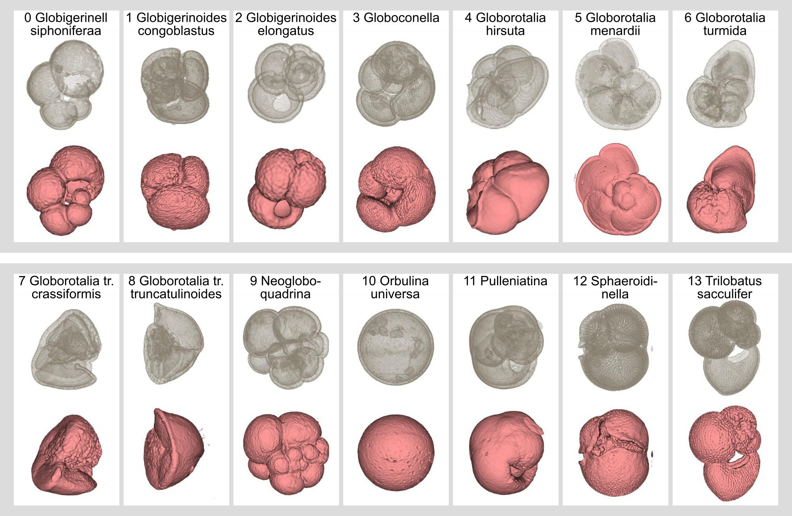
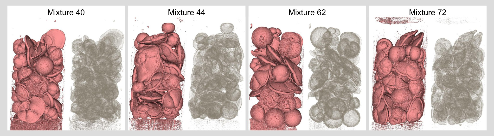
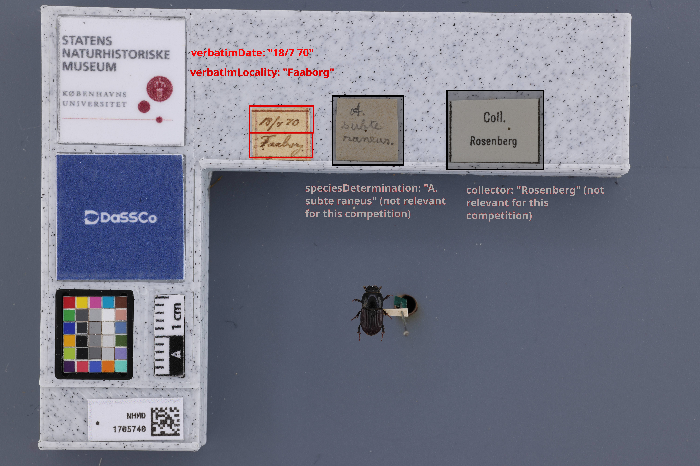

CVNH workshop introduces two dataset challenges: <b>Foram2026</b> and <b>MuseumLabel2026</b>.

<h4>Submissions</h4>
<b>Format and platform</b>: The predictions will be submitted as a CSV file in Kaggle. The exact format (expected rows and columns) is specified in the corresponding Kaggle challenge page.

<b>Deadline</b>: August 31, 2026.

<b>Winners</b>: The winners of the challenges will be announced at the workshop. The winners will receive a signed diploma, and they will be invited to participate in a paper related to the datasets.

<b>Short description</b>: We ask all participants to submit a brief description of their method (max. 1 page PDF) before the deadline. A link to submit this description will be provided. Although this is not a requirement for participating in the challenge, it is a <u>requirement</u> to qualify as a winner and being invited to participate in the paper.

<b>One slide</b>: Similarly to the "Short description", we ask all participants to provide one slide explaining their approach. All slides will be combined and shown at the workshop. Although this is not a requirement for participating in the challenge, it is a <u>requirement</u> to qualify as a winner and being invited to participate in the paper.

<h2>Foram2026 Challenge - <a href="https://www.kaggle.com/competitions/forams-2026" target="_blank">Kaggle Competition</a></h2>

<b>Task</b>: Detection and classification of microCT 3D scans of Forameniferas.

<b>Dataset size</b>: 2425 labelled 3D volumes of individual forams + 95 unlabelled 3D volumes contained mixed specimens.

<b>Example volume</b>:

<u>Training set</u>

<u>Test set</u>

<h2>MuseumSCAT2026 Challenge - <a href="https://www.kaggle.com/competitions/museumscat-specimen-collection-annotation-task/overview" target="_blank">Kaggle Competition</a></h2>

<b>Task</b>: Text recognition and text type identification (e.g., "date", "locality") in museum label photographs.

<b>Dataset size</b>: 3500 images and annotations.

<b>Example image</b>:

Sign up in [our newsletter](/cfp) to be notified about updates.
